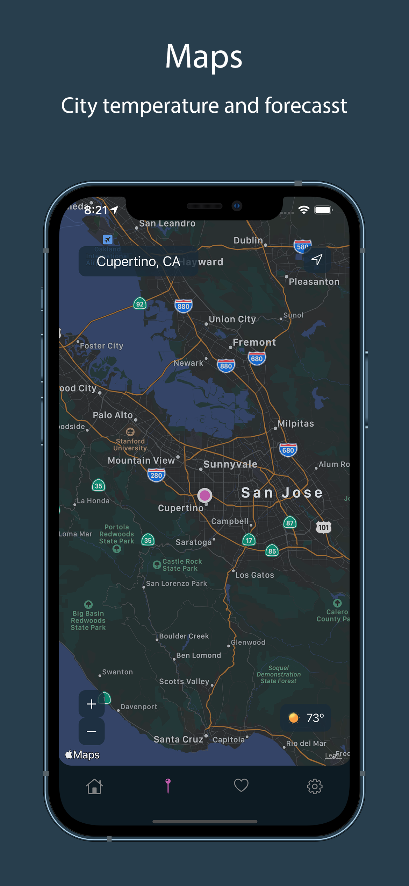
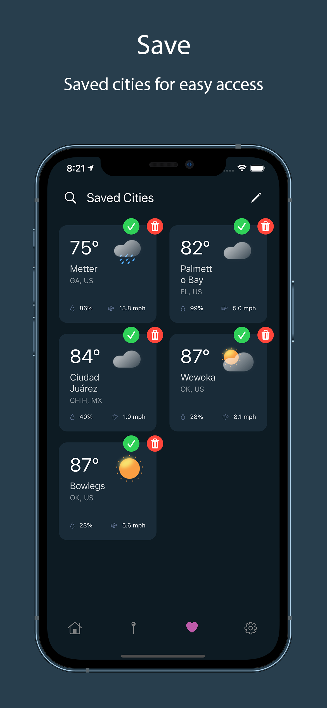
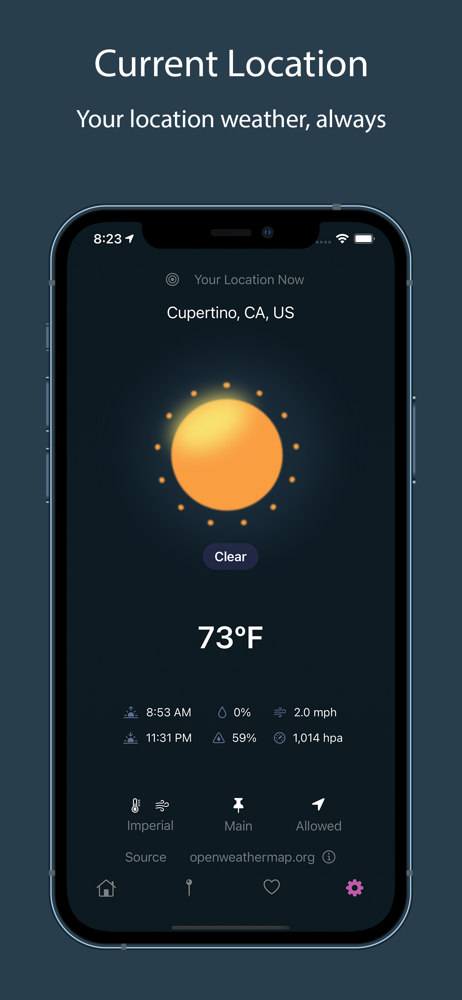

<h1 align=center>Hi there 👋, I'm <br> &lt;Jem/&gt;</h1>

[](https://twitter.com/official_JemAl)
[](https://github.com/JemAlvarez)
[](https://stackoverflow.com/users/13363630/bluestarxd)
[](https://www.linkedin.com/in/jem-alvarez-046962164/)
[](https://www.jemalvarez.com)


#

[](https://git.io/typing-svg)

**Currently working with:**<br>


**Previously worked with:**<br>


---

# Recent iOS Projects

### [Notes App](https://github.com/JemAlvarez/NotesApp_SwiftUI_iOS14)
```
Notes app using SwiftUI 2 and CoreData
```
* SwiftUI 2
* MVVM
* CoreData
* UserDefaults
* WatchOS
* WidgetKit
* LocalAuthentication


### [Weather App](https://github.com/JemAlvarez/WeatherApp_SwiftUI_iOS14)
```
Weather app using SwiftUI 2, CoreLocation & CoreData
```
* SwiftUI 2
* MVVM
* CoreData
* UserDefaults
* WidgetKit
* CoreLocation



### [Card Memory Game](https://github.com/JemAlvarez/MemoryCardGame_SwiftUI_iOS14)
```
Classic card memory game with different difficulties inspired by the SuperSmashBros game
```
* SwiftUI 2
* MVVM
* CustomAnimations


### [Covid Tracker](https://github.com/JemAlvarez/COVID_Tracker_SwiftUI_iOS14)
```
Worldwide covid data and specif countries and states
```
* SwiftUI 2
* MVVM
* API Requests
* WebKit


---

**📈Stats:**

<br>
<br>
<br>
<br>
<br>

