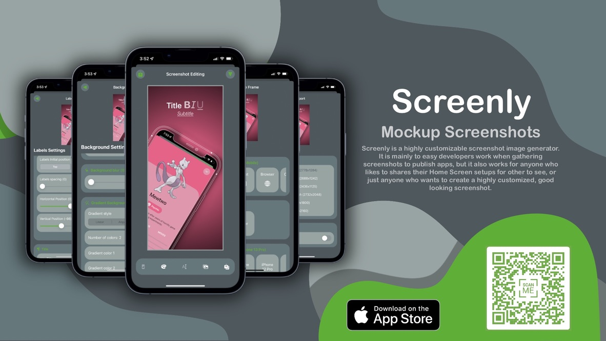

<h1 align=center>Hi there 👋, I'm <br> &lt;Jem/&gt;</h1>

[](https://twitter.com/official_JemAl)
[](https://github.com/JemAlvarez)
[](https://stackoverflow.com/users/13363630/bluestarxd)
[](https://www.linkedin.com/in/jem-alvarez-046962164/)
[](https://www.jemalvarez.com)


#

[](https://git.io/typing-svg)

**Currently working with:**<br>


**Previously worked with:**<br>


---

# Recent iOS Projects

### [Screenly - Mockup Screenshots](https://apps.apple.com/us/app/screenly-mockup-screenshots/id1592798429)
```
Screenly is a highly customizable screenshot mockup image generator
```
* SwiftUI
* UIKit
* MVVM
* Ads
* In-App Purchases
* Reach top 30 in charts
* 4.9⭐ - 50 Ratings - Worldwide



### [Gyfter – Occasion Reminders](https://apps.apple.com/us/app/id1615132443)
```
Gyfter helps you rember those special occasions you know you shoudln't forget
```
* SwiftUI
* UIKit
* MVVM
* In-App Purchases
* CloudKit + CoreData
* UserNotifications
* WidgetKit
* WatchOS


### [Movieholic](https://github.com/JemAlvarez/Movieholic)
```
Movies app for information from a database for MacOS
```
* SwiftUI 3
* MVVM
* Async/Await
* API
* Custom Navigation Router


### [Sketchoo](https://github.com/JemAlvarez/Sketchoo)
```
Drawing app using PencilKit for iOS and IpadOS
```
* SwiftUI 3
* UIKit
* MVVM
* UIGestures
* PencilKit


### [Movies App For iOS](https://github.com/JemAlvarez/iOS-Movies)
```
Movies app using SwiftUI for iOS
```
* SwiftUI


---

**📈Stats:**

<br>
<br>
<br>
<br>
<br>

